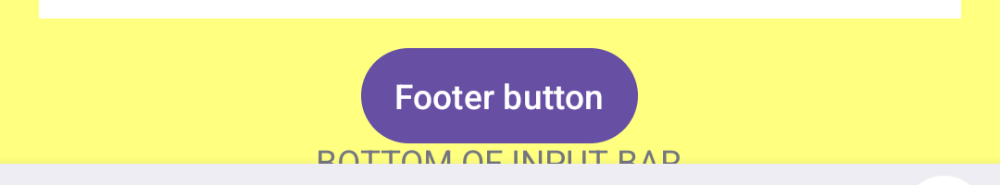

# Android: bottomInputBar bottom edge still clips above Gboard

SDK-only reproduction of the residual defect after DartNative #20. No forms_kit, app services, custom insets, application plugins, or keyboard listeners. `lib/main.dart` is unchanged from the original reproduction; Android platform sources are now included so the checkout runs directly.

## Run

Install the DartNative SDK, make `dn` available, and boot an Android emulator with Gboard:

```sh
git clone https://github.com/reynard93/dartnative-input-repros.git
cd dartnative-input-repros/android-keyboard
dn pub get --no-example
dn run --no-pub -d <android-device-id>
```

`dn pub get` generates the plugin registrant. `dn run` supplies local SDK paths and Gradle wrapper files. No SDK binaries, local SDK paths, signing keys or application secrets are distributed.

1. Before focusing the field, observe the complete yellow input bar, Footer button, and BOTTOM OF INPUT BAR label.
2. Tap the field to open real Gboard.
3. Footer is now above the keyboard, but the label below it remains clipped.
4. Tap Footer with the keyboard open; the app prints `FOOTER_TAPPED`.
5. Enter three lines using Gboard, dismiss the keyboard, then reopen it. The field expands, but the same bottom-label clipping recurs. The full label returns after dismissal.

Expected: the complete `Scaffold.bottomInputBar`, including bottom padding and labels below the focused field, remains above the keyboard.

## Latest verified environment

- SDK framework `9689ca2d76bdd4ffb121eb09274b06edf143ab3f`, 3.45.0-0.1.pre.
- Engine `bda36d8992`; Dart `3.12.0-192.0.dev`.
- Fresh Pixel 7 Android 16/API 36 ARM64 emulator, Google Play image, 1080 x 2400, density 420 dpi.
- Real Gboard (`com.google.android.inputmethod.latin`), not a test IME.
- Original source clean-built with the updated SDK, then verified through native taps, multiline typing and repeated keyboard open/close. No physical-device retest claimed.

## Current evidence

[Sanitized geometry and interaction receipt](evidence-9689ca2d76/receipt.json).

Keyboard open:



Keyboard dismissed:


[Multiline full-screen capture](evidence-9689ca2d76/03-multiline-keyboard.png) and [successful Footer callback](evidence-9689ca2d76/footer-tap.log.txt).

Measured physical pixels:

- Gboard starts at y=1517.
- Footer bottom is y=1495: fully clear, 22 px gap.
- Only 14 of the label's 26 glyph rows remain visible.
- Single-line yellow bar: 460 px visible without keyboard, 397 with it.
- Multiline yellow bar: 570 px visible without keyboard, 507 with it.
- Both lose 63 px, matching the 63 px bottom system area below the bar before keyboard opening. An inset/coordinate-space mismatch is a hypothesis, not an inspected SDK source diagnosis.

## Impact and workaround

This is a non-crashing visibility defect. Footer clicks work in this reproduction; there is no evidence of data loss. It still obscures actual bar content and can affect helper/error text placed below the editor.

The application currently avoids the affected Android slot: native scaffold resizing is disabled and the composer sits in a finite body viewport subtracting system padding, app-bar height and IME insets. Native `bottomInputBar` remains on iOS. Keep that workaround until complete bar bounds and keyboard transitions pass. Its application-specific geometry is not a universal SDK fix.

## Historical pre-fix evidence

The original `2186eee074` reproduction also hid the Footer button. [Original source and receipt](https://github.com/reynard93/dartnative-input-repros/tree/ad817e7f6250045813e911f4f167a0db88dc1bd8/android-keyboard) remain available. The old `before.png` and `keyboard-open.png` in this directory belong to that earlier capture, not the current SDK.
