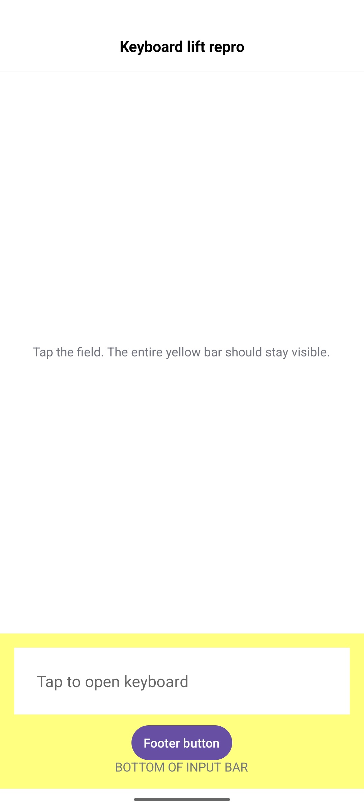
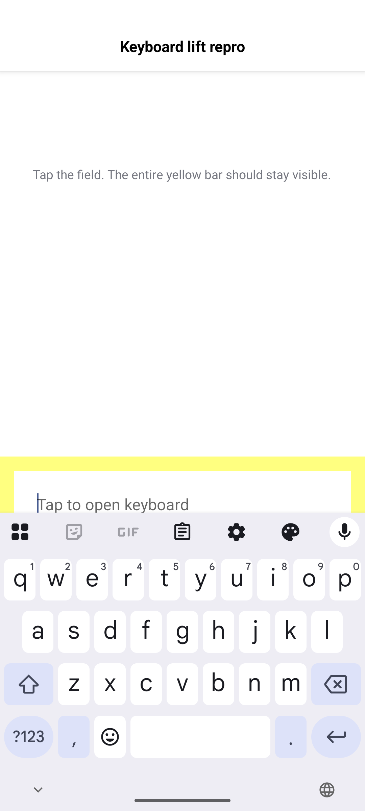

# Android: bottomInputBar does not lift the complete bar above the keyboard

Minimal SDK-only reproduction. No forms_kit, app services, custom insets, plugins, or keyboard listeners.

## Run

Install the DartNative SDK, make `dn` available, and boot an Android emulator with a software keyboard.

```sh
git clone https://github.com/reynard93/dartnative-input-repros.git
cd dartnative-input-repros
dn create --empty --platforms android --org dev.repro --project-name keyboard_lift_repro /tmp/keyboard_lift_repro
cp android-keyboard/main.dart /tmp/keyboard_lift_repro/lib/main.dart
cp android-keyboard/pubspec.yaml /tmp/keyboard_lift_repro/pubspec.yaml
cd /tmp/keyboard_lift_repro
dn pub get --no-example
dn run -d <android-device-id>
```

`dn create`/`dn pub get` generate platform files and `lib/dartnative_plugin_registrant.dart`. No SDK binaries or generated bindings are distributed here.

1. Before focusing the field, observe the yellow input bar, Footer button, and BOTTOM OF INPUT BAR label.
2. Tap the text field and open Gboard.
3. Observe that the field is lifted only partially above the keyboard; the Footer button and bottom label are covered.
4. Dismiss the keyboard using Android Back. The covered controls become visible again.

Expected: the complete `Scaffold.bottomInputBar` stays above the keyboard, including its padding and controls below the focused field.

Actual: native lift protects the focused field rather than the complete registered input bar.

## Verified environment

- DartNative 3.45.0-0.1.pre, stable, framework 2186eee074 (2026-09-13).
- Engine revision bda36d8992; Dart 3.12.0-192.0.dev.
- Brand-new Pixel 7 AVD, Android 16/API 36, arm64-v8a, Google Play image.
- Build fingerprint: google/sdk_gphone64_arm64/emu64a:16/BE2A.250530.026.D1/13818094:user/release-keys.
- Display: 1080 x 2400 physical pixels, density 420 dpi.
- Gboard 15.1.08.726012951-preload-arm64-v8a.
- Reproduced after native debug build, then again after force-stop/cold launch using standard `adb shell input tap` with Gboard selected. No text-injection helper is needed.

## Evidence





Both screenshots are from the minimal source in this directory. The open-keyboard screenshot shows the yellow bar cut at the keyboard edge, with its lower controls missing.

## Application workaround

On Android, avoid `bottomInputBar` for the affected composer: disable native scaffold resizing and place the composer at the bottom of a finite body viewport whose height subtracts system padding, app-bar height, and `MediaQuery.viewInsets.bottom`. Keep native `bottomInputBar` on iOS. Padding around the native input slot did not fix the application case.

The manual height calculation depends on the application's chrome and is not a universal SDK replacement. Remove it only after verifying an SDK fix with complete bar bounds, multiline input, and keyboard open/close transitions.
